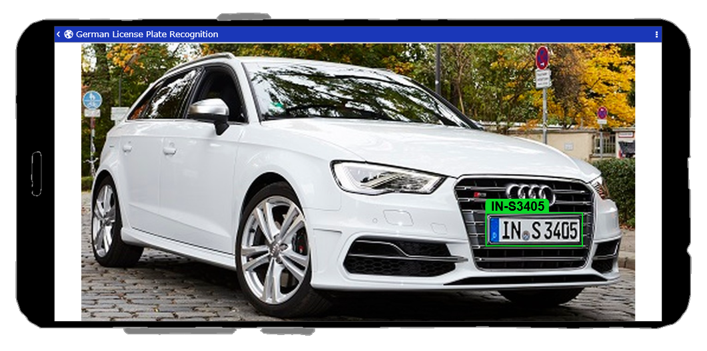

# **German License Plate Recognition**

## Project Introduction

Android camera app for automatic recognition of German license plates.

### License Plate Detection

- [Data_Exploration_And_Preparation](1_License_Plate_Detection_Data_Exploration_And_Preparation.ipynb)
- [Model Training And Evaluation](2_License_Plate_Detection_Model_Training_And_Evaluation.ipynb)

### License Recognition

- [Data_Collection And Exploration](3_License_Recognition_Data_Collection_And_Exploration.ipynb)
- [Model Training And Evaluation](4_License_Recognition_Model_Training_And_Evaluation.ipynb)

[License Detection And Recognition Workflow](5_License_Recognition_Workflow.ipynb)

